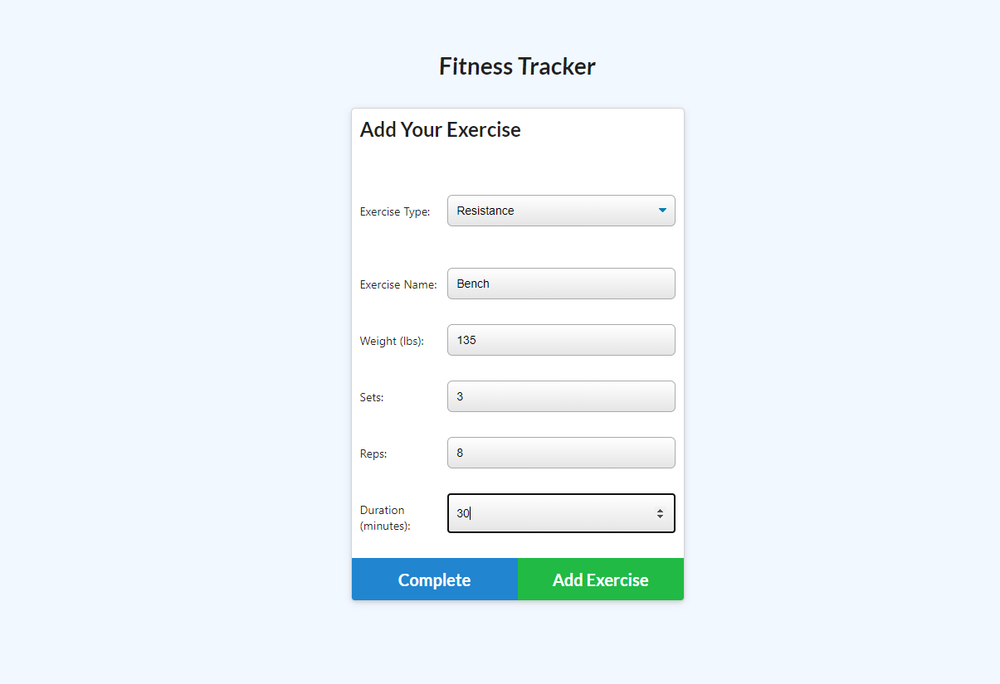

# The Fitness Tracker

Finally! A workout tracker that works for you!
 
## Technologies Used

* [Express.js](https://expressjs.com/)
* [Node.js](https://nodejs.org/en/)
* [Mongoose.js](https://mongoosejs.com/)
* [MongoDB](https://www.mongodb.com/)
* [Chart.js](https://www.chartjs.org/)


## Table of Contents

1. [Description](#Description)
2. [Installation](#Installation)
3. [Usage](#Usage)
4. 


## Description

The Fitness Tracker enables the user to create and add workouts to a database and track these workouts in a dashboard. The user can also go in and continue old workouts and achieve their fitness goals. Lastly, a stats page will end up getting generated.
The user has the capability to add either cardio or resistance training to a mongo database. The user input is stored by day. This fitness tracker also provides the user with a series of charts to view their fitness progress by day, by duration of each exercise, and by pounds lifted.


## Installation

* Clone the repository to your local device.
* Install the necessary npm packages by typing in the following command in the terminal:

```
npm install
```

## Usage

* This app is simple to run and is set up to use port 7000 for local running. Start the program in terminal with the code below:

```
node server.js 
```

* Another way to run this App is to, Navigate to [Heroku site](https://fitness-mongo.herokuapp.com/) and get started to use this Application.

* In the home page the user is presented with their last workout. If they choose to continue they may click "Continue Workout" to add another exercise.
* If the user wants to begin a new workout press the "New Workout" button.
* Choose an exercise type: Cardio or Resistance. Now enter some information about the exercise into input fields (name, miles, distance, weight, reps, etc.)
* Choose to complete the workout or add another exercise.
* Once workout is complete the user selects "Complete". Then they are taken back to the home screen where they can view their last workout information.
* User may navigate to the dashboard page to view charts representing their workout progress. Categories include duration of workout by day, duration by exercise type, weight lifted by exercise, and weight lifted by day.


## Screenshots




